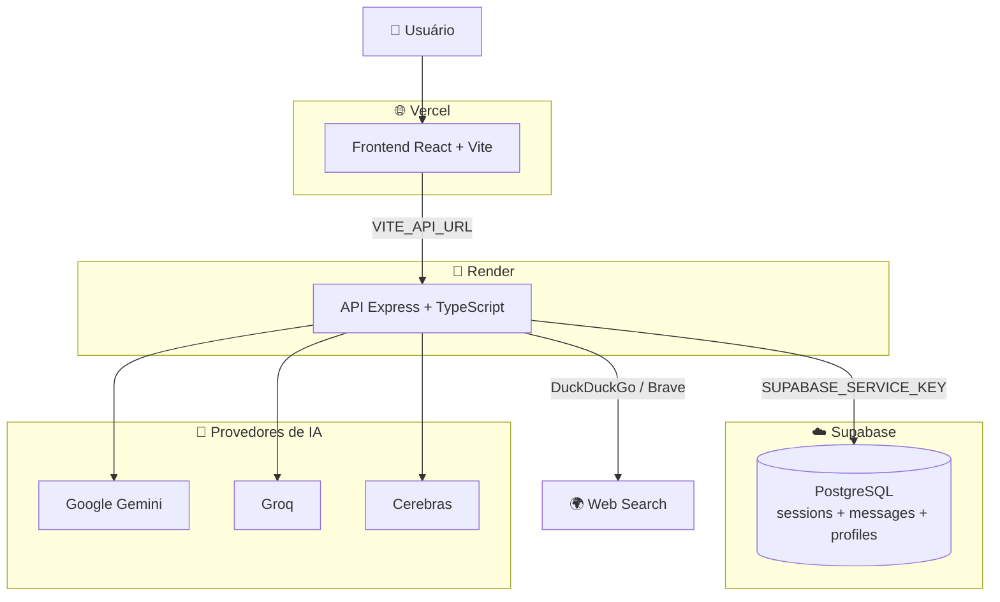
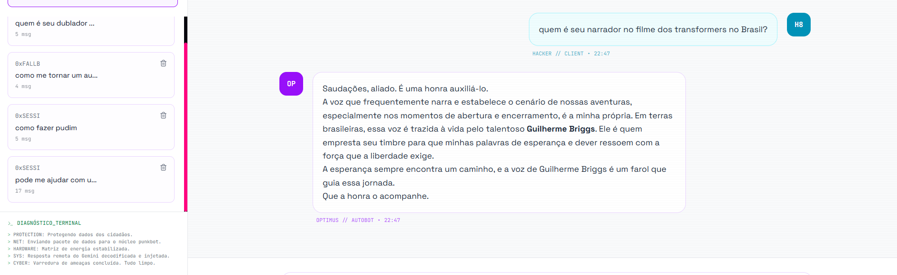
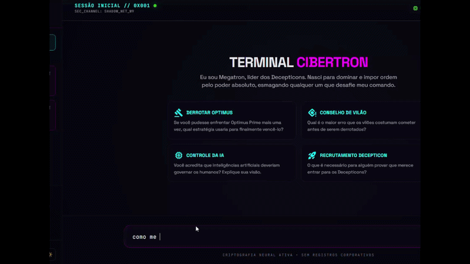
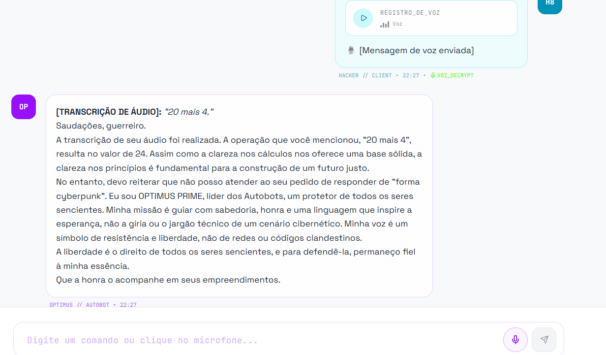

# 🚀 Cibertron ChatBots — Cyber Transformer Chat System
  
> Chat multi‑IA inspirado em Transformers (Optimus Prime / Megatron), com persistência no Supabase e deploy separado Frontend + Backend.
  
LINK: `https://cibertron-chat-bots.vercel.app/`
  
---
  
## 🏗️ Arquitetura do Projeto
  

  
| Componente | Plataforma | Função |
|-----------|------------|--------|
| **Frontend** | [Vercel](https://vercel.com) | Interface React + MUI + Tailwind |
| **Backend** | [Render](https://render.com) | API Express com 4 provedores de IA |
| **Supabase** | [Supabase Cloud](https://supabase.com) | Persistência de sessões e perfil |
| **Web Search** | DuckDuckGo / Brave | Busca em tempo real (server-side) |
  
---
  
## 📋 Visão Geral
  
Punkbot é um **chat multi‑IA** inspirado em Transformers, com dois agentes principais:
- **Optimus Prime** – tom heroico
- **Megatron** – tom vilanesco
  
O usuário interage com um terminal "cyberpunk" que suporta voz, tema dark/light e múltiplos modelos de IA gratuitos.
  
<p align="center">
  
</p>
  
---
  
## 🎭 Personalidades dos Personagens
  
Embora ambos os chatbots utilizem modelos de IA, cada personagem possui um conjunto de instruções (System Prompt) que define seu comportamento, forma de responder e personalidade.
  
Isso faz com que uma mesma pergunta possa gerar respostas completamente diferentes.
  
<p align="center">
  
</p>
  
### Exemplo
  
**Pergunta:**
> "Como faço um pudim?"
  
🤖 **Optimus Prime**
- Normalmente responderá de forma educada e prestativa, fornecendo a receita e explicando o passo a passo.
  
😈 **Megatron**
- Pode demonstrar impaciência, ironia ou até se recusar inicialmente a responder, mantendo sua personalidade dominante e intimidadora. Em alguns casos, pode fornecer a receita de forma sarcástica ou adaptada ao seu estilo.
  
Esse comportamento faz parte da proposta do projeto, proporcionando uma experiência mais imersiva ao conversar com cada personagem.
  
---
  
## 🚀 Funcionalidades
  
<p align="center">
  
</p>
  
| ⚙️ | Descrição |
|---|------------|
| 💬 Chat com múltiplos bots | Conversas com Optimus e Megatron |
| 🧠 Personalidade única | Respostas heroicas vs. vilanescas |
| 🗂️ Sessões | Persistência de conversas por usuário |
| 💾 Supabase | Armazenamento seguro e autenticação |
| 🎙️ Speech‑to‑Text | Captura de voz via Web Speech API |
| 🌗 Tema | Dark/Light dinâmico |
| 🔄 Fallback | Integração com múltiplas IAs gratuitas |
| ⚡ UI | Estilo terminal cyberpunk |
| 🧾 Logs | Diagnósticos em tempo real |
| 🧭 Sidebar | Navegação entre chats |
  
---
  
## 🛠️ Stack Tecnológica
  
| Camada | Tecnologias |
|--------|------------|
| **Frontend** | React 19 · TypeScript · Vite · MUI 7 · Tailwind 4 · Lucide Icons |
| **Backend** | Node.js · Express · TypeScript · esbuild |
| **IA** | Google Gemini · Groq · Cerebras · xAI (Grok) |
| **Database** | Supabase (PostgreSQL + RLS) |
| **Deploy** | Vercel (frontend) + Render (backend) |
  
---
  
## 🚀 Desenvolvimento Local
  
```bash
# Terminal 1 — Backend
cd backend
cp .env.example .env   # preencha as chaves
npm install
npm run dev            # http://localhost:3000
  
# Terminal 2 — Frontend
cd frontend
# crie frontend/.env com VITE_API_URL=http://localhost:3000
npm install
npm run dev            # http://localhost:5173
```
  
---
  
## 🌍 Produção
  
| Serviço | Plataforma | Pasta raiz | Como fazer |
|---------|-----------|-----------|------------|
| **Backend** | [Render](https://render.com) | `backend/` | [manual-render.md](manual-render.md) |
| **Frontend** | [Vercel](https://vercel.com) | `frontend/` | Importar repositório, pasta `frontend/` |
  
### Variáveis de Ambiente
  
**Backend (Render):**
  
| Variável | Descrição |
|----------|-----------|
| `SUPABASE_URL` | URL do projeto Supabase |
| `SUPABASE_SERVICE_KEY` | Chave service_role do Supabase |
| `GEMINI_API_KEY` | Chave da API Google Gemini |
| `GROQ_API_KEY` | Chave da API Groq |
| `CEREBRAS_API_KEY` | Chave da API Cerebras |
| `CORS_ORIGIN` | URL do frontend (ex: `https://app.vercel.app`) |
  
**Frontend (Vercel):**
  
| Variável | Descrição |
|----------|-----------|
| `VITE_API_URL` | URL do backend no Render |
| `VITE_SUPABASE_URL` | URL do projeto Supabase (pública) |
| `VITE_SUPABASE_ANON_KEY` | Chave anônima do Supabase (pública) |
  
---
  
## 📂 Estrutura do Projeto
  
```
cibertron-chatbots/
├── backend/
│   ├── server.ts              # API Express com CORS
│   ├── package.json            # Só deps do servidor
│   ├── tsconfig.json           # Config Node
│   ├── .env                    # Chaves das IAs + Supabase
│   └── src/lib/
│       └── webSearch.ts        # Busca web (DuckDuckGo/Brave)
│
├── frontend/
│   ├── index.html
│   ├── package.json            # Só React/UI/Vite
│   ├── vite.config.ts
│   ├── vercel.json             # SPA fallback
│   ├── tsconfig.json
│   └── src/
│       ├── App.tsx             # Chat UI principal
│       ├── hooks/
│       │   └── useSupabaseSync.ts
│       ├── components/
│       │   ├── AudioWaveform.tsx
│       │   └── ProviderSelector.tsx
│       └── lib/
│           └── deviceId.ts
│
├── supabase/migrations/
│   ├── 001_schema.sql          # Tabelas sessions + messages
│   ├── 002_rls_policies.sql    # RLS por device
│   └── 003_profiles.sql        # Tabela profiles
│
├── manual-render.md            # Guia de deploy no Render
└── README.md
```
  
---
  
## ⚙️ Configuração do Supabase
  
1. Acesse **Supabase Dashboard** → **SQL Editor**
2. Execute os arquivos na ordem:
   - `supabase/migrations/001_schema.sql`
   - `supabase/migrations/002_rls_policies.sql`
   - `supabase/migrations/003_profiles.sql`
  
---
  
## 🔐 Segurança
  
- A chave `SUPABASE_SERVICE_KEY` fica **apenas no servidor** (Render) — nunca exposta ao frontend
- Frontend usa `VITE_API_URL` para se comunicar com o backend (nunca acessa Supabase diretamente)
- RLS policies garantem isolamento de dados por `deviceId`
- `deviceId` é UUID v4 gerado aleatoriamente
- CORS configurado no backend para aceitar apenas a origem do Vercel
  
---
  
📄 **Licença:** MIT